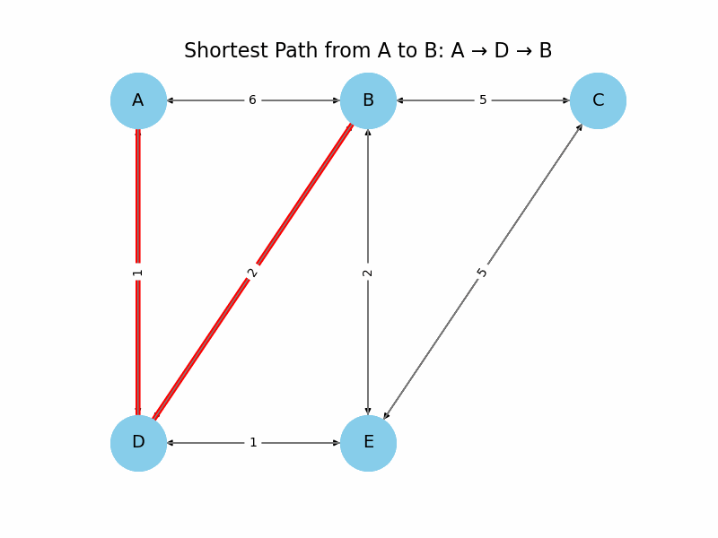

# Dijkstra’s Shortest Path Visualisation with NetworkX

This project demonstrates how to implement **Dijkstra’s algorithm** using Python and NetworkX to find the shortest path in a directed, weighted network. The output includes a step-by-step visualisation of the algorithm in action, rendered as a GIF.

<p align="center">
  
</p>

## Objective

Given a set of directed links with weights, this notebook:
- Loads and constructs a network graph from a CSV file
- Applies Dijkstra's algorithm to compute the shortest path between nodes
- Visualizes the graph and highlights the shortest path dynamically

## Files

- `shortest paths.ipynb`: Jupyter Notebook that contains all the code and explanation
- `network links.csv`: Source file containing the directed edges and weights
- `shortest_paths.gif`: Animated visualization of the shortest path discovery process

## Technologies Used

- Python 3
- NetworkX
- Matplotlib
- Pandas
- Jupyter Notebook

## How to Run

1. Clone the repository:
   ```bash
   git clone https://github.com/yourusername/shortest-path-dijkstra.git
   cd shortest-path-dijkstra

2. Install dependencies (if using a virtual environment):
   ```bash
   pip install networkx matplotlib pandas jupyter

3. Launch the notebook:
   ```bash
   jupyter notebook "shortest paths.ipynb"

## Sample Output
The shortest path from A to B is:
A → D → B (Total cost: 3)
This path is highlighted in red in the animated GIF above.

### Use Cases
- Transportation route planning
- Network optimization
- Logistics and supply chain modeling
- Educational demonstrations in graph theory

📄 License
This project is licensed under the MIT License.
